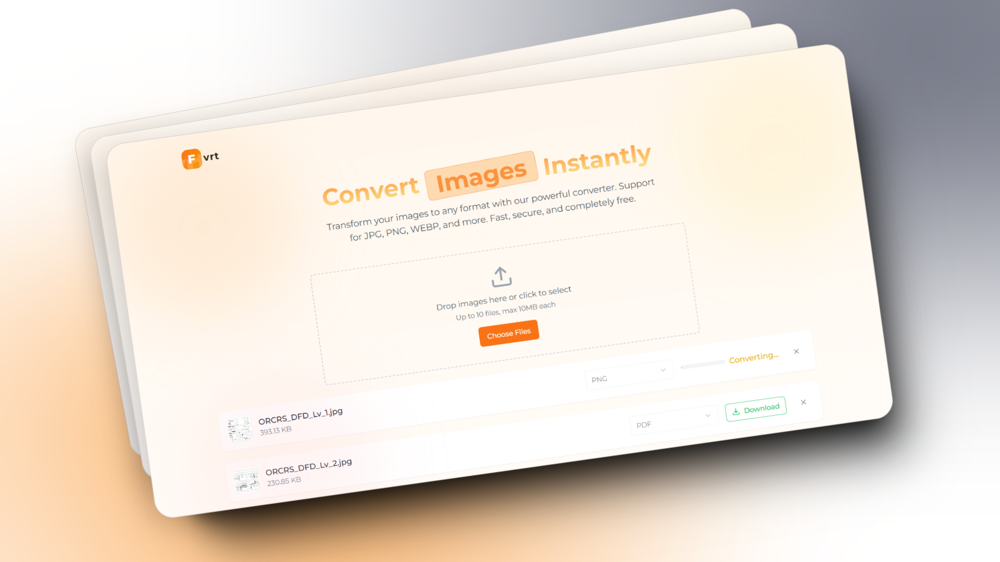

# FVRT - Your Go-To Image Converter

FVRT is a powerful and efficient image converter built using **Next.js** and **TypeScript**. It allows you to seamlessly convert multiple images with features like intelligent format detection, high-speed processing, and batch downloads, ensuring a smooth user experience.

## Features

### 1. **Multiple Images**
- Convert up to 10 images at a time.
- Real-time progress tracking for an enhanced user experience.

### 2. **Smart Conversion**
- Intelligent format detection ensures compatibility.
- Optimized conversion to maintain quality.

### 3. **Batch Download**
- Download all converted images in one go.
- A single ZIP file for easy management using **jszip** and **file-saver**.

### 4. **High Speed**
- Experience fast and efficient conversion with minimal delay.
- Perfect for time-sensitive tasks.

### 5. **Drag-and-Drop Upload**
- Simplify file selection with a drag-and-drop interface powered by **react-dropzone**.

### 6. **Browser Compatibility**
- Utilizes **browser-image-compression** for efficient image compression directly in the browser.
- No need for server-side processing, ensuring faster results.

### 7. **Modern Design**
- Designed with **Shadcn** for an elegant and user-friendly interface.

## How to Use

1. **Upload Images**: Drag and drop up to 10 images using the intuitive drag-and-drop interface or select them manually from your device.
2. **Select Format**: Choose the desired output format (e.g., PNG, JPEG, etc.).
3. **Convert**: Click the convert button and track the real-time progress.
4. **Download**: Once completed, download all images in a single ZIP file using the batch download feature.

## Tech Stack

- **Next.js**: A React framework for building fast and scalable web applications.
- **TypeScript**: Ensures robust and type-safe development.
- **react-dropzone**: Simplifies file uploads with a drag-and-drop interface.
- **jszip**: Handles ZIP file creation for batch downloads.
- **file-saver**: Enables smooth ZIP file creation and downloads.
- **browser-image-compression**: Handles efficient image compression within the browser.
- **Shadcn**: Provides a modern and customizable UI framework.

## Why Choose FVRT?

- **User-Friendly**: Simplistic and intuitive interface.
- **Optimized**: High-quality output with intelligent format detection.
- **Convenience**: Batch processing and single-click download for efficient workflows.
- **Secure**: All processing is done in the browser, ensuring your images are not uploaded to external servers.

## Contributing
Contributions are welcome! If you have suggestions for new features or improvements, feel free to submit an issue or pull request.

---

Effortless image conversion, one click at a time!
